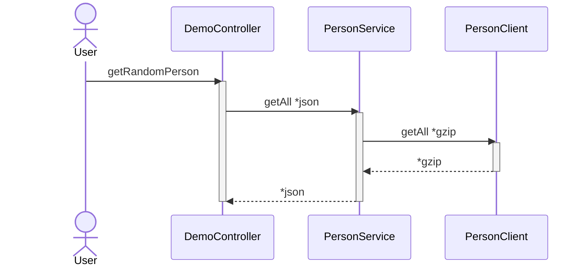

# Feign compression

Testing feign-client with gzip compression enabled



# Run
```
docker-compose up
```

# Client
Request
```
curl -I 'http://localhost:9090/demo/person?amount=999'
```
application/json
```
HTTP/1.1 200
Content-Type: application/json
Transfer-Encoding: chunked
Date: Sun, 29 Jan 2023 01:31:28 GMT
```
So, checkout the log have Gzip enabled on Feign Client
```
client-1 : [PersonClient#getAll] ---> GET http://server:9191/api/faker?amount=999 HTTP/1.1
client-1 : [PersonClient#getAll] Accept-Encoding: gzip
client-1 : [PersonClient#getAll] Accept-Encoding: deflate
client-1 : [PersonClient#getAll] ---> END HTTP (0-byte body)
server-1 : Before request [GET /api/faker?amount=999, headers=[accept-encoding:"gzip", "deflate", accept:"*/*", content-length:"0", host:"server:9191"]]
client-1 : [PersonClient#getAll] <--- HTTP/1.1 200  (88ms)
client-1 : [PersonClient#getAll] connection: keep-alive
client-1 : [PersonClient#getAll] content-type: application/json
client-1 : [PersonClient#getAll] date: Sun, 29 Jan 2023 14:25:26 GMT
client-1 : [PersonClient#getAll] keep-alive: timeout=60
client-1 : [PersonClient#getAll] transfer-encoding: chunked
client-1 : [PersonClient#getAll] vary: accept-encoding
client-1 : [PersonClient#getAll] <--- END HTTP (98150-byte body)
server-1 : After request [GET /api/faker?amount=999, headers=[accept-encoding:"gzip", "deflate", accept:"*/*", content-length:"0", host:"server:9191"]]
```

# Server
Simulating feign client
```
curl -I -H "Accept-Encoding: gzip" 'http://localhost:9191/api/faker?amount=999'
```
Gzip enabled
```
HTTP/1.1 200
vary: accept-encoding
Content-Encoding: gzip
Content-Type: application/json
Transfer-Encoding: chunked
Date: Sun, 29 Jan 2023 01:29:08 GMT
```

# Result

```
./result.sh

-rw-r--r--  1 cex  staff    96K Jan 29 15:20 999.json
-rw-r--r--  1 cex  staff    32K Jan 29 15:20 999.json.gz
-rw-r--r--  1 cex  staff   962K Jan 29 15:20 9999.json
-rw-r--r--  1 cex  staff   302K Jan 29 15:20 9999.json.gz
-rw-r--r--  1 cex  staff   9.4M Jan 29 15:20 99999.json
-rw-r--r--  1 cex  staff   2.9M Jan 29 15:20 99999.json.gz
-rw-r--r--  1 cex  staff    94M Jan 29 15:20 999999.json
-rw-r--r--  1 cex  staff    29M Jan 29 15:21 999999.json.gz
-rw-r--r--  1 cex  staff   940M Jan 29 15:25 9999999.json
-rw-r--r--  1 cex  staff   281M Jan 29 15:29 9999999.json.gz
```
Ratio

| Amount  | json | gzip  | Ratio |
|---------|:----:|:-----:|:-----:|
| 999     | 96K  |  32K  |  67%  |
| 9999    | 962K | 302K  |  68%  |
| 99999   | 9.4M | 2.9M  |  69%  |
| 999999  | 94M  |  29M  |  69%  |
| 9999999 | 940M | 281M  |  70%  |


# Jaeger

http://localhost:16686/


# Ref
* [feign_request_response_compression](https://cloud.spring.io/spring-cloud-netflix/multi/multi_spring-cloud-feign.html#_feign_request_response_compression)
* [distributed-tracing-spring-boot-opentracing-jaeger](https://refactorfirst.com/distributed-tracing-spring-boot-opentracing-jaeger.html)