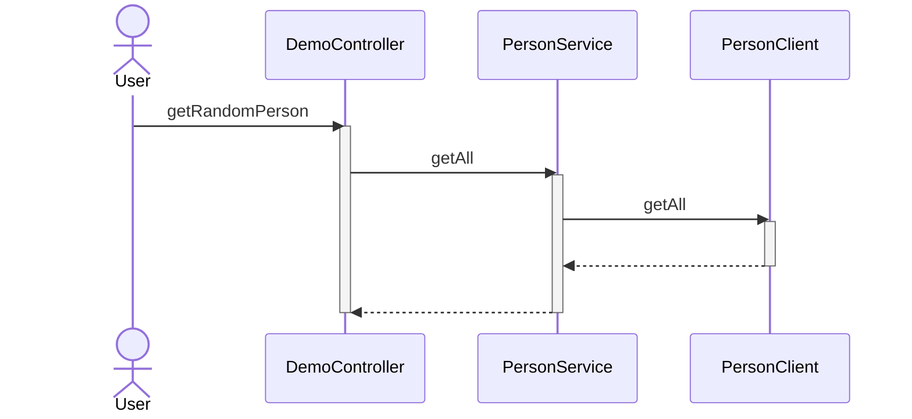

# Feign compression

Testing feign client with gzip compression enabled




# Build
```
./gradlew build
```

# Run
```
./gradlew :server:bootRun
./gradlew :client:bootRun
```

# Client
Request
```
curl -I 'http://localhost:9090/demo/person?amount=999'
```
application/json
```
HTTP/1.1 200
Content-Type: application/json
Transfer-Encoding: chunked
Date: Sun, 29 Jan 2023 01:31:28 GMT
```
So, checkout the log have Gzip enabled on Feign Client
```
[PersonClient#getAll] <--- END HTTP (985130-byte body)
[PersonClient#getAll] ---> GET http://localhost:9191/api/faker?amount=999 HTTP/1.1
[PersonClient#getAll] Accept-Encoding: gzip
[PersonClient#getAll] Accept-Encoding: deflate
[PersonClient#getAll] ---> END HTTP (0-byte body)
[PersonClient#getAll] <--- HTTP/1.1 200  (279ms)
[PersonClient#getAll] connection: keep-alive
[PersonClient#getAll] content-type: application/json
[PersonClient#getAll] date: Sun, 29 Jan 2023 01:26:05 GMT
[PersonClient#getAll] keep-alive: timeout=60
[PersonClient#getAll] transfer-encoding: chunked
[PersonClient#getAll] vary: accept-encoding
[PersonClient#getAll] <--- END HTTP (98538-byte body)
```

# Server
Simulating feign client
```
curl -I -H "Accept-Encoding: gzip" 'http://localhost:9191/api/faker?amount=999'
```
Gzip enabled
```
HTTP/1.1 200
vary: accept-encoding
Content-Encoding: gzip
Content-Type: application/json
Transfer-Encoding: chunked
Date: Sun, 29 Jan 2023 01:29:08 GMT
```

# Ref
* [feign_request_response_compression](https://cloud.spring.io/spring-cloud-netflix/multi/multi_spring-cloud-feign.html#_feign_request_response_compression)